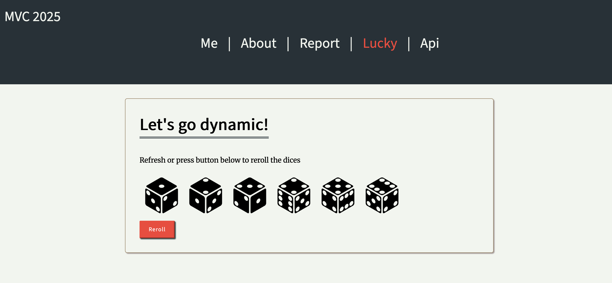

# mvc

# Kom igång 

## Följ installationsguiden nedan

1. Börja med att installera Php och Composer, vilket är det programmeringsspråk som används. Composer är ett program för att installera och hålla koll på externa moduler. Guiden förutsätter att du har npm installerat, vilket är ett program för att hantera javascript relaterade moduler och versioner.

### Mac (kräver homebrew)
brew install php@8.1
brew install composer

### Linux
sudo apt install php8.1
sudo php composer-setup.php --install-dir=/usr/local/bin --filename=composer
 - obs notera att composer installeras globalt

### Windows
För windows och PHP, följ instruktionerna på [php.net](https://www.php.net/downloads "windows php")

För Composer, följ instruktionerna på: [composer.org ](https://getcomposer.org/download/ "windows composer")

2. Kontrollera att php samt composer blivit installerat korrekt,

Öppna terminalen / kommandotolken och kör "php --version" samt composer --version.

du ska då få något i stil med:
`Composer version 2.8.5 2025-01-21 15:23:40
PHP version 8.4.4 (/opt/homebrew/Cellar/php/8.4.4/bin/php)
Run the "diagnose" command to get more detailed diagnostics output.`

# Klona report
Ställ dig i din projektmapp och kör kommandot `git clone XX`

# Installera dependencies
kör sedan `composer install` fölt av `npm install` för att installera samtliga moduler och paket.
Om du får någon promt, tryck Enter för default installation.

# Skapa assets
För att få med bilder i form av assets, kör `npm run build`, detta kommer att göra dina bilder under assets/images till assets
och hamna i public/build/images. Om detta inte körs kommer bilderna inte visas korrekt då bilder hänvisar genom `{{ path(asset/build/images/<bild>)}}`

# Starta servern
Kör sedan `symfony server:start` och gå till lokalhost:8000

# Uppdatera .htaccess
För att publicera till studentservern, justera sökvägen för ReWriteRule i public/.htaccess